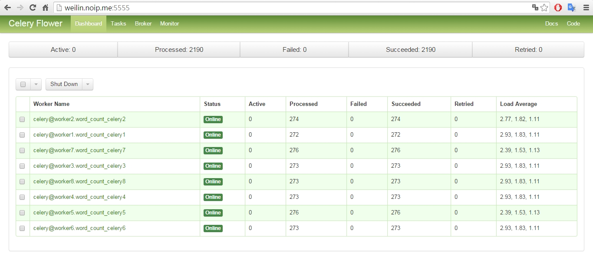

# Celery on Docker Swarm  

Wei Lin

### Abstract
 In the territory of Python, Celery is a famous distributed task queue framework, its Canvas mechanism is specially powerful in building complex workflow. 

 Celery can function in distributed environment and go perfectly along with Docker-Swarm: Docker-Swarm provides a cluster environment and the worker containers to sustain Celery; worker containers and processes and be dynamically scaled and expanded to fulfill Celery's need, work together parallelly to accomplish the computation. 
 
 With Docker-Swarm , a cluster will be built upon two Raspberry Pi machines. Hadoop entry-level "Word Count" program will be re-writen in Python and executed parallelly via Celery on the cluster.

## Steps:

### 1. Establish a Docker Swarm: 
With reference to the article "[Let Docker Swarm all over your Raspberry Pi Cluster](http://blog.hypriot.com/post/let-docker-swarm-all-over-your-raspberry-pi-cluster/)", a Docker-Swarm had been built upon two Raspberry Pi machines.

#### The swarm is composited fo two Docker machines:
- host rpi202(192.168.0.114) as Swarm Manager，the Docker machine name is "master01".
- host rpi201(192.168.0.109) as Swarm Node，the Docker machine name is "node01".


```python
HypriotOS: pi@rpi202 in ~
$ docker-machine ls
NAME       ACTIVE   DRIVER    STATE     URL                        SWARM
master01            hypriot   Running   tcp://192.168.0.114:2376   master01 (master)
node01              hypriot   Running   tcp://192.168.0.109:2376   master01
HypriotOS: pi@rpi202 in ~
$


# Nodes in the swarm:

HypriotOS: pi@rpi202 in ~
$ docker $(docker-machine config --swarm master01) info
Containers: 4
Images: 51
Role: primary
Strategy: spread
Filters: health, port, dependency, affinity, constraint
Nodes: 2
 master01: 192.168.0.114:2376
  └ Status: Healthy
  └ Containers: 3
  └ Reserved CPUs: 0 / 4
  └ Reserved Memory: 0 B / 972 MiB
  └ Labels: executiondriver=native-0.2, kernelversion=4.1.8-hypriotos-v7+, operatingsystem=Raspbian GNU/Linux 8 (jessie), provider=hypriot, storagedriver=overlay
 node01: 192.168.0.109:2376
  └ Status: Healthy
  └ Containers: 1
  └ Reserved CPUs: 0 / 4
  └ Reserved Memory: 0 B / 972 MiB
  └ Labels: executiondriver=native-0.2, kernelversion=4.1.8-hypriotos-v7+, operatingsystem=Raspbian GNU/Linux 8 (jessie), provider=hypriot, storagedriver=overlay
CPUs: 8
Total Memory: 1.899 GiB
Name: b7def5d9af98
HypriotOS: pi@rpi202 in ~
$
```

### 2. Establish the broker for Celery, with a Docker container running Redis.


```python
HypriotOS: pi@rpi202 in ~
$ docker run -d -p 6379:6379 --net=mynet --name=redis --volume=/data:/data hypriot/rpi-redis
a2abf9277b5e4818da89ffa282a706506ef288426486cc25b431208564bf6e0f


HypriotOS: pi@rpi202 in ~
$ docker ps
CONTAINER ID        IMAGE                      COMMAND                  CREATED             STATUS              PORTS                                                                    NAMES
a2abf9277b5e        hypriot/rpi-redis          "/entrypoint.sh redis"   13 hours ago        Up About an hour    0.0.0.0:6379->6379/tcp                                                   redis
f0ce33ca1152        hypriot/rpi-swarm          "/swarm join --advert"   6 days ago          Up 6 days           2375/tcp                                                                 swarm-agent
b7def5d9af98        hypriot/rpi-swarm          "/swarm manage --tlsv"   6 days ago          Up 6 days           0.0.0.0:3376->3376/tcp, 2375/tcp                                         swarm-agent-master
ad594813f8f0        nimblestratus/rpi-consul   "/bin/start -server -"   6 days ago          Up 6 days           53/udp, 8300-8302/tcp, 8301-8302/udp, 8400/tcp, 0.0.0.0:8500->8500/tcp   consul
HypriotOS: pi@rpi202 in ~
$
```

### 3. Copy celeryconfig.py、start_workers.sh、and the folder "word_count" to two hosts, under the folder of /data/celery_projects. 


```python
HypriotOS: pi@rpi202 in /data/celery_projects
$ ll
total 20
drwxr-xr-x 3  999 root 4096 Jan 25 23:01 ./
drwxr-xr-x 3  999 root 4096 Jan 25 23:01 ../
-rw-r--r-- 1  999 root 1079 Jan 25 21:12 celeryconfig.py
-rwxr-xr-x 1  999 root  732 Jan 25 22:53 start_workers.sh*  <--- script to start up worker containers.
drwxr-xr-x 3 root root 4096 Jan 25 23:01 word_count/
HypriotOS: pi@rpi202 in /data/celery_projects
$


HypriotOS: pi@rpi201 in /data/celery_projects
$ ll
total 20
drwxr-xr-x 3 root root 4096 Jan 25 23:03 ./
drwxr-xr-x 3  999 root 4096 Jan 25 22:55 ../
-rw-r--r-- 1 root root 1079 Jan 25 21:12 celeryconfig.py 
drwxr-xr-x 3 root root 4096 Jan 25 23:03 word_count/
HypriotOS: pi@rpi201 in /data/celery_projects
$
```

### 4. Establish [Flower ](http://docs.celeryproject.org/en/latest/userguide/monitoring.html#flower-real-time-celery-web-monitor) container for monitoring.


```python
HypriotOS: pi@rpi202 in ~
$ docker run -d -p 5555:5555 --net=mynet --name=flower --volume=/data/celery_projects:/celery_projects wei1234c/celery_armv7 /bin/sh -c "cd /celery_projects && celery -A word_count flower"
276f00591fd7042139ddf660730d223bcf19e9f8bd369f075de417140b6dfd4a
HypriotOS: pi@rpi202 in ~
$


HypriotOS: pi@rpi202 in ~
$ docker ps
CONTAINER ID        IMAGE                      COMMAND                  CREATED             STATUS              PORTS                     NAMES
276f00591fd7        wei1234c/celery_armv7      "/bin/sh -c 'cd /cele"   31 seconds ago      Up 27 seconds       0.0.0.0:5555->5555/tcp    flower
```

#### Connect to container of Flower, view with a web browser, no tasks yet.


### 5. Deploy Celery worker containers through Swarm-Manager.

#### deploy worker containers with :
start_workers.sh


```python
# ./start_workers.sh

echo "Starting Celery cluster containers _________________________________________________"

eval $(docker-machine env --swarm master01)

PROJECT=$1  # project name
WORKER_START_ID=$2  # worker container index, the first one. 
WORKER_LAST_ID=$3  # worker container index, the last one. 
CONCURRENCY=$4  # number of subprocesses per worker.

for (( i=${WORKER_START_ID}; i<=${WORKER_LAST_ID}; i=i+1 ))
do
  docker run -d --name=${PROJECT}_celery${i} --hostname=${PROJECT}_celery${i} --net=mynet --volume=/data/celery_projects:/celery_projects wei1234c/celery_armv7 /bin/sh -c "cd /celery_projects && celery -A ${PROJECT} worker -n worker${i}.%h --concurrency=${CONCURRENCY} --loglevel=INFO"
done
```

#### Establish Celery worker containers for the first round.
Four containers were established，each container has one Celery worker，each worker can have 5 subprocesses at most。


```python
# CLI parameters:
# $1 # project name
# $2 # worker container index, the first one.
# $3 # worker container index, the last one.  
# $4 # number of subprocesses per worker.

HypriotOS: pi@rpi202 in /data/celery_projects
$ ./start_workers.sh word_count 1 4 5
Starting Celery cluster containers _________________________________________________
a22b08a0818b3246f90511ad21cb2a0ab37a4e72661bf559ade7e320db030505
77eabded27e4ea3aaa640480c088fa7b4b9818fc3e40fb66636cc9abe8a78e69
df05a7204f40470cfd8eee21a06be45f5a306ea32df0196f3d004beac5d2f82d
e67d39740ace5c2a5b9a05e6ca1adc73c5e5944e62302d02391d37f7ee6aa479


# Four containers were established，each container has one Celery worker，each worker can have 5 subprocesses at most。

HypriotOS: pi@rpi202 in /data/celery_projects
$ docker ps
CONTAINER ID        IMAGE                      COMMAND                  CREATED              STATUS              PORTS                                                                          NAMES
e67d39740ace        wei1234c/celery_armv7      "/bin/sh -c 'cd /cele"   About a minute ago   Up About a minute   5555/tcp                                                                       node01/word_count_celery4
df05a7204f40        wei1234c/celery_armv7      "/bin/sh -c 'cd /cele"   About a minute ago   Up About a minute   5555/tcp                                                                       node01/word_count_celery3
77eabded27e4        wei1234c/celery_armv7      "/bin/sh -c 'cd /cele"   About a minute ago   Up About a minute   5555/tcp                                                                       node01/word_count_celery2
a22b08a0818b        wei1234c/celery_armv7      "/bin/sh -c 'cd /cele"   About a minute ago   Up About a minute   5555/tcp                                                                       node01/word_count_celery1
276f00591fd7        wei1234c/celery_armv7      "/bin/sh -c 'cd /cele"   37 minutes ago       Up 5 minutes        192.168.0.114:5555->5555/tcp                                                   master01/flower
a2abf9277b5e        hypriot/rpi-redis          "/entrypoint.sh redis"   13 hours ago         Up About an hour    192.168.0.114:6379->6379/tcp                                                   master01/redis
980161d10fc4        hypriot/rpi-swarm          "/swarm join --advert"   6 days ago           Up 6 days           2375/tcp                                                                       node01/swarm-agent
f0ce33ca1152        hypriot/rpi-swarm          "/swarm join --advert"   6 days ago           Up 6 days           2375/tcp                                                                       master01/swarm-agent
b7def5d9af98        hypriot/rpi-swarm          "/swarm manage --tlsv"   6 days ago           Up 6 days           2375/tcp, 192.168.0.114:3376->3376/tcp                                         master01/swarm-agent-master
ad594813f8f0        nimblestratus/rpi-consul   "/bin/start -server -"   6 days ago           Up 6 days           53/udp, 8300-8302/tcp, 8301-8302/udp, 8400/tcp, 192.168.0.114:8500->8500/tcp   master01/consul
HypriotOS: pi@rpi202 in /data/celery_projects
$
```

#### Flower shows the status. There are four workers.
- celery@worker1.word_count_celery1
- celery@worker2.word_count_celery2
- celery@worker3.word_count_celery3
- celery@worker4.word_count_celery4  


#### Expand Celery worker containers for the second round.
The Celery cluster can be scaled up dynamically, in response to the need of performance.  
Adding 4 containers, each container has one Celery worker, each worker has 5 subprocesses at most.   


```python
# CLI parameters:
# $1 # project name
# $2 # worker container index, the first one.
# $3 # worker container index, the last one.  
# $4 # number of subprocesses per worker.

HypriotOS: pi@rpi202 in /data/celery_projects
$ ./start_workers.sh word_count 5 8 5
Starting Celery cluster containers _________________________________________________
a4de4967fd6211266cbad04fecfc357aa81789063cca3042388019adab2a6c71
7066ba6021de870f1332858c6f96673a159d7e5031a5682d3853fa6bd8fe2252
79792c823fbf2769e4983c525598c30ba3758c23697ef66a78a54163374d3233
25c02d07ed6f1217ee68dc486a6586262ca2e3ed01a2a8690eaa2a783ad07d73


HypriotOS: pi@rpi202 in /data/celery_projects
$ docker ps
CONTAINER ID        IMAGE                      COMMAND                  CREATED              STATUS              PORTS                                                                          NAMES
25c02d07ed6f        wei1234c/celery_armv7      "/bin/sh -c 'cd /cele"   18 seconds ago       Up 12 seconds       5555/tcp                                                                       node01/word_count_celery8
79792c823fbf        wei1234c/celery_armv7      "/bin/sh -c 'cd /cele"   39 seconds ago       Up 25 seconds       5555/tcp                                                                       master01/word_count_celery7
7066ba6021de        wei1234c/celery_armv7      "/bin/sh -c 'cd /cele"   About a minute ago   Up 45 seconds       5555/tcp                                                                       node01/word_count_celery6
a4de4967fd62        wei1234c/celery_armv7      "/bin/sh -c 'cd /cele"   About a minute ago   Up About a minute   5555/tcp                                                                       master01/word_count_celery5
e67d39740ace        wei1234c/celery_armv7      "/bin/sh -c 'cd /cele"   15 minutes ago       Up 15 minutes       5555/tcp                                                                       node01/word_count_celery4
df05a7204f40        wei1234c/celery_armv7      "/bin/sh -c 'cd /cele"   15 minutes ago       Up 15 minutes       5555/tcp                                                                       node01/word_count_celery3
77eabded27e4        wei1234c/celery_armv7      "/bin/sh -c 'cd /cele"   15 minutes ago       Up 15 minutes       5555/tcp                                                                       node01/word_count_celery2
a22b08a0818b        wei1234c/celery_armv7      "/bin/sh -c 'cd /cele"   16 minutes ago       Up 16 minutes       5555/tcp                                                                       node01/word_count_celery1
276f00591fd7        wei1234c/celery_armv7      "/bin/sh -c 'cd /cele"   51 minutes ago       Up 19 minutes       192.168.0.114:5555->5555/tcp                                                   master01/flower
a2abf9277b5e        hypriot/rpi-redis          "/entrypoint.sh redis"   14 hours ago         Up 2 hours          192.168.0.114:6379->6379/tcp                                                   master01/redis
980161d10fc4        hypriot/rpi-swarm          "/swarm join --advert"   6 days ago           Up 6 days           2375/tcp                                                                       node01/swarm-agent
f0ce33ca1152        hypriot/rpi-swarm          "/swarm join --advert"   6 days ago           Up 6 days           2375/tcp                                                                       master01/swarm-agent
b7def5d9af98        hypriot/rpi-swarm          "/swarm manage --tlsv"   6 days ago           Up 6 days           2375/tcp, 192.168.0.114:3376->3376/tcp                                         master01/swarm-agent-master
ad594813f8f0        nimblestratus/rpi-consul   "/bin/start -server -"   6 days ago           Up 6 days           53/udp, 8300-8302/tcp, 8301-8302/udp, 8400/tcp, 192.168.0.114:8500->8500/tcp   master01/consul
HypriotOS: pi@rpi202 in /data/celery_projects
$
```

#### We can also view the list of Swarm nodes.


```python
HypriotOS: pi@rpi201 in /data/celery_projects
$ docker ps
CONTAINER ID        IMAGE                   COMMAND                  CREATED             STATUS              PORTS               NAMES
25c02d07ed6f        wei1234c/celery_armv7   "/bin/sh -c 'cd /cele"   16 minutes ago      Up 16 minutes       5555/tcp            word_count_celery8
7066ba6021de        wei1234c/celery_armv7   "/bin/sh -c 'cd /cele"   17 minutes ago      Up 17 minutes       5555/tcp            word_count_celery6
e67d39740ace        wei1234c/celery_armv7   "/bin/sh -c 'cd /cele"   32 minutes ago      Up 31 minutes       5555/tcp            word_count_celery4
df05a7204f40        wei1234c/celery_armv7   "/bin/sh -c 'cd /cele"   32 minutes ago      Up 32 minutes       5555/tcp            word_count_celery3
77eabded27e4        wei1234c/celery_armv7   "/bin/sh -c 'cd /cele"   32 minutes ago      Up 32 minutes       5555/tcp            word_count_celery2
a22b08a0818b        wei1234c/celery_armv7   "/bin/sh -c 'cd /cele"   32 minutes ago      Up 32 minutes       5555/tcp            word_count_celery1
980161d10fc4        hypriot/rpi-swarm       "/swarm join --advert"   6 days ago          Up 6 days           2375/tcp            swarm-agent
HypriotOS: pi@rpi201 in /data/celery_projects
$
```

#### Flower shows the workers.  We have 8 of them now.


### "Word Count" program re-writen in Python.


```python
from word_count.tasks import * 
 
# split text file into a list of words    
def getWordsFromText(file = '.\\text\\test.txt'):
    with open(file) as f:
        lines = f.readlines()        
    return ' '.join(lines).replace(',', '').replace('.', '').split()


def reduce(word_counts):    
    wordCounts = {}
    
    for word_count in word_counts:
        if word_count is not None: 
            wordCounts[word_count[0]] = wordCounts.get(word_count[0], 0) + word_count[1]
        
    result = sorted(list(wordCounts.items()), 
                    key = lambda x: (x[1], x[0]), 
                    reverse = True)    
    return result
```


```python
# list of words
words = getWordsFromText()
words[:3]
```


    ["Aesop's", 'Fables', 'Translated']


```python
# how many words in the article.
len(words)
```


    2190


#### ./word_count/tasks.py , which contains  mapper function:
    from celery import group
    from word_count.celery import app 
    
    @app.task
    def mapper(word):
        return (word, 1) if len(word) >= 5 else None    # discard words which are too short.

### Send messages to Celery workers, computing in parallel.


```python
def count_celery(words):
    
    # send messages to Celery workers.
    asyncResults = [mapper.s(word).delay() for word in words]  # mapper function is defined in ./word_count/tasks.py
    results = [asyncResult.get() for asyncResult in asyncResults if asyncResult.get() is not None]

    return reduce(results)  

%time counts = count_celery(words)
counts[:5]
```

    Wall time: 3min 23s


    [('would', 12), ('which', 8), ('their', 8), ('caught', 6), ('Farmer', 6)]


#### As messages sent，Flower shows the status.
  

#### Finished.


#### Showing CPUs' load during the processing.


## Summary:
 With respect to Hadoop ecosystem, we can actually build a parallel-computing cluster in minutes with Celery and Docker-Swarm. This practice could be used as a handy tool in some circumstances.
