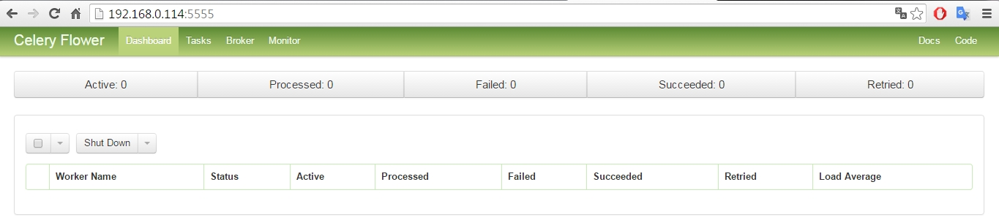
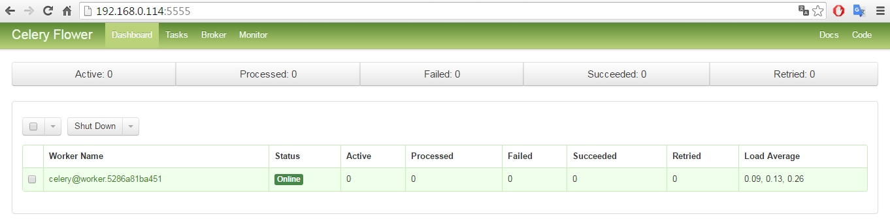
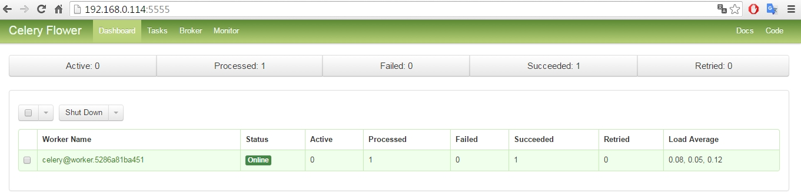
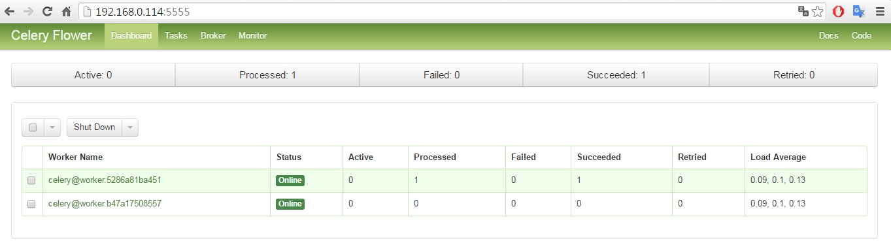
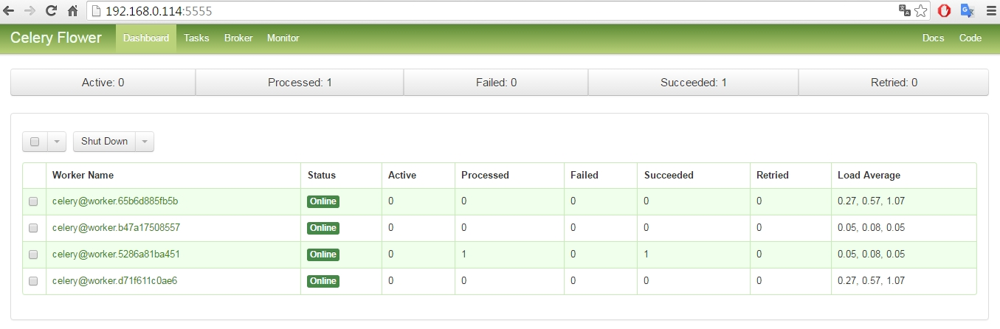
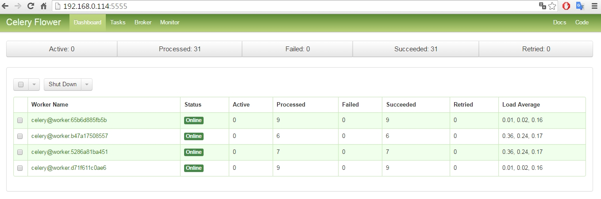

# [One for all, All for one](https://www.youtube.com/watch?v=FcMCd520Ae8)
### [SETI@home](https://en.wikipedia.org/wiki/SETI@home) liked [Volunteer Computing](https://en.wikipedia.org/wiki/Volunteer_computing) on Mixed-Platforms Cluster - using Celery and Docker

Wei Lin  
20160512  

## Experiment procedure:

### Define Dockerfile for RPi: 
Celery Worker Dockerfile for ARM v7  
image name: wei1234c/one_for_all_all_for_one_armv7 


```python
# one_for_all_all_for_one_armv7
# Celery Worker Dockerfile
# for ARM v7
# 20160512
 
FROM wei1234c/celery_armv7

MAINTAINER Wei Lin

USER root

RUN	mkdir /celery_projects

WORKDIR /celery_projects

COPY . /celery_projects/
 
RUN	chmod +x /celery_projects/start_workers.sh

USER pi

CMD ["/bin/sh", "/celery_projects/start_workers.sh"]
```

### Build Docker image for RPi: 
image name: wei1234c/one_for_all_all_for_one_armv7


```python
HypriotOS: pi@rpi202 in ~
$ docker build -t wei1234c/one_for_all_all_for_one_armv7 /dockerfiles/ARMv7/one_for_all_all_for_one
Sending build context to Docker daemon 9.216 kB
Step 1 : FROM wei1234c/celery_armv7
 ---> 8939b7e5c928
Step 2 : MAINTAINER Wei Lin
 ---> Using cache
 ---> 186c6ea155e8
Step 3 : USER root
 ---> Using cache
 ---> b84c84193d65
Step 4 : RUN mkdir /celery_projects
 ---> Using cache
 ---> fff839303a93
Step 5 : WORKDIR /celery_projects
 ---> Using cache
 ---> 27938d9d6ae8
Step 6 : COPY . /celery_projects/
 ---> c120021c8dc0
Removing intermediate container 5b4421e5472b
Step 7 : RUN chmod +x /celery_projects/start_workers.sh
 ---> Running in f719c550c90d
 ---> efa549c140dd
Removing intermediate container f719c550c90d
Step 8 : USER pi
 ---> Running in 1c7a5587769b
 ---> 427f37517ba9
Removing intermediate container 1c7a5587769b
Step 9 : CMD /bin/sh /celery_projects/start_workers.sh
 ---> Running in ed24629cb0ba
 ---> d7bb6603b6c6
Removing intermediate container ed24629cb0ba
Successfully built d7bb6603b6c6
HypriotOS: pi@rpi202 in ~
$ 
```

### Define Dockerfile for amd64: 
Celery Worker Dockerfile for amd64  
image name: wei1234c/one_for_all_all_for_one


```python
# one_for_all_all_for_one
# Celery Worker Dockerfile
# for amd64
# 20160512
 
FROM ubuntu

MAINTAINER Wei Lin

USER root

# Add user pi
RUN \
	useradd -G adm,sudo,users -s /bin/bash -m pi && \
	echo 'pi:raspberry' | chpasswd


#RUN pip3 install pandas

# Install Python. ____________________________________________________________________________________________
RUN apt-get update && \
    apt-get install -y python3 python3-pip python3-dev python3-numpy python3-scipy python3-matplotlib python3-pandas && \
    apt-get install -y python python-pip python-dev

# Install Celery  ____________________________________________________________________________________________
RUN \
	pip3 install -U celery

RUN \
	pip3 install -U redis

RUN	mkdir /celery_projects
	
WORKDIR /celery_projects

COPY . /celery_projects/
 
RUN	chmod +x /celery_projects/start_workers.sh

USER pi

CMD ["/bin/sh", "/celery_projects/start_workers.sh"]
```

### Build Docker image for amd64: 
image name: wei1234c/one_for_all_all_for_one


```python
wei@Wei-Lenovo:~$ docker build -t wei1234c/one_for_all_all_for_one /docker/dockerfiles/amd64/one_for_all_all_for_one
Sending build context to Docker daemon 9.728 kB
Step 1 : FROM ubuntu
 ---> c5f1cf30c96b
Step 2 : MAINTAINER Wei Lin
 ---> Using cache
 ---> 626cc4694d46
Step 3 : USER root
 ---> Using cache
 ---> 9212cedf802b
Step 4 : RUN useradd -G adm,sudo,users -s /bin/bash -m pi &&    echo 'pi:raspberry' | chpasswd
 ---> Using cache
 ---> a237ec2f3a84
Step 5 : RUN apt-get update &&     apt-get install -y python3 python3-pip python3-dev python3-numpy python3-scipy python3-matplotlib python3-pandas &&     apt-get install -y python python-pip python-dev
 ---> Using cache
 ---> f65b7e004075
Step 6 : RUN pip3 install -U celery
 ---> Using cache
 ---> 3764134da5f1
Step 7 : RUN pip3 install -U redis
 ---> Using cache
 ---> 61772207fc08
Step 8 : RUN mkdir /celery_projects
 ---> Using cache
 ---> c68f9dc73b5c
Step 9 : WORKDIR /celery_projects
 ---> Using cache
 ---> b9e490c48b98
Step 10 : COPY . /celery_projects/
 ---> Using cache
 ---> 55e921f0a082
Step 11 : RUN chmod +x /celery_projects/start_workers.sh
 ---> Using cache
 ---> 194e82a97639
Step 12 : USER pi
 ---> Using cache
 ---> 740675730169
Step 13 : CMD /bin/sh /celery_projects/start_workers.sh
 ---> Using cache
 ---> d77e8341bf85
Successfully built d77e8341bf85
wei@Wei-Lenovo:~$
```

### Run container for Celery Broker, using Redis


```python
HypriotOS: pi@rpi202 in ~
$ docker run -d -p 6379:6379 --name=redis --volume=/data:/data hypriot/rpi-redis
2ee100973b0e1317e7511de0c97b2a29ad02a688f9928c14f347922a4aa3fb5d

HypriotOS: pi@rpi202 in ~
$ docker ps
CONTAINER ID        IMAGE               COMMAND                  CREATED             STATUS              PORTS                    NAMES
2ee100973b0e        hypriot/rpi-redis   "/entrypoint.sh redis"   8 seconds ago       Up 7 seconds        0.0.0.0:6379->6379/tcp   redis
HypriotOS: pi@rpi202 in ~
$
```

### Run [Flower](http://docs.celeryproject.org/en/latest/userguide/monitoring.html#flower-real-time-celery-web-monitor) container for monitoring


```python
HypriotOS: pi@rpi202 in ~
$ docker run -d -p 5555:5555 --name=flower wei1234c/one_for_all_all_for_one_armv7 /bin/sh -c "cd /celery_projects && celery -A stock flower"
3c6e9e85417b536d07562575711e5f288097ed48d6f12c0129155d01ea746e66

HypriotOS: pi@rpi202 in ~
$ docker ps
CONTAINER ID        IMAGE                                    COMMAND                  CREATED             STATUS              PORTS                    NAMES
3c6e9e85417b        wei1234c/one_for_all_all_for_one_armv7   "/bin/sh -c 'cd /cele"   9 seconds ago       Up 7 seconds        0.0.0.0:5555->5555/tcp   flower
2ee100973b0e        hypriot/rpi-redis                        "/entrypoint.sh redis"   2 hours ago         Up 2 hours          0.0.0.0:6379->6379/tcp   redis
HypriotOS: pi@rpi202 in ~
$
```

### No worker running, nothing shows in Flower.



### Run Celery worker container on Raspberry Pi
### <font color='red'>Volunteer can join the cluster for distributed parallel computing, simply by running this Docker image.</font>


```python
HypriotOS: pi@rpi202 in ~
$ docker run -d --name=musketeer1 wei1234c/one_for_all_all_for_one_armv7
5286a81ba451b8473ef2b5e3bb965a7b0fc31511e1ed4e368659aece2478e053

HypriotOS: pi@rpi202 in ~
$ docker ps
CONTAINER ID        IMAGE                                    COMMAND                  CREATED             STATUS              PORTS                    NAMES
5286a81ba451        wei1234c/one_for_all_all_for_one_armv7   "/bin/sh /celery_proj"   4 seconds ago       Up 3 seconds        5555/tcp                 musketeer1
3c6e9e85417b        wei1234c/one_for_all_all_for_one_armv7   "/bin/sh -c 'cd /cele"   5 minutes ago       Up 5 minutes        0.0.0.0:5555->5555/tcp   flower
2ee100973b0e        hypriot/rpi-redis                        "/entrypoint.sh redis"   2 hours ago         Up 2 hours          0.0.0.0:6379->6379/tcp   redis
HypriotOS: pi@rpi202 in ~
$
```

### After Celery worker container started, it showed up in Flower.  However, no task message was received yet.



### In package "stock" there is a file "tasks.py", containing function "get_table" with which we define task message.


```python
from stock.celery import app

import pandas as pd
from datetime import datetime


def get_url(stock_id, year = datetime.today().year, month = datetime.today().month):
    return 'http://www.twse.com.tw/ch/trading/exchange/STOCK_DAY/genpage/Report{year}{month:02}/{year}{month:02}_F3_1_8_{stock_id}.php?STK_NO={stock_id}&myear={year}&mmon={month:02}'.format(stock_id = stock_id, year = year, month = month)


@app.task
def get_table(stock_id, year = datetime.today().year, month = datetime.today().month):
    
    url = get_url(stock_id, year, month) 
    targetTableIndex = 0
    
    table = pd.read_html(url,
                         attrs = {'border': '0' , 
                                  'width': '598', 
                                  'align': 'center', 
                                  'cellpadding': '0', 
                                  'cellspacing': '1', 
                                  'class': 'board_trad'},
                         header = 1
                        )[targetTableIndex]
    
    table['stock_id'] = stock_id
    table = table.reindex(columns = ['stock_id', 'date', 'quantity', 'amount', 'open', 'highest', 'lowest', 'close', 'offset', 'trades'])
    
    return table.tail(1).values
```


```python
# load stock.tasks, which contains the definition of function "get_table".
from stock.tasks import * 
import numpy as np
```


```python
# Excute get_table funtion directly from local host (OS: Windows 7)
# No task message was sent to Celery broker
get_table(2356)
```


    array([[2356, '105/05/12', 5614182, 114086911, 20.2, 20.55, 20.1, 20.3,
            -0.1, 3159]], dtype=object)


### Asynchronous function call
**<font color='red'>In IPython Notebook on local host, we sent a task message to Celery cluster, demanding computing service.  
There is no Docker mechanism on local host (OS: Windows 7).</font>**   
With "get_table.apply_async()" a task message will be sent to Celery Broker.  
Celery Broker will put the task message into a queue.  
Worker on Raspberry Pi will pick up the message from queue and excute it, and return the result.


```python
r = get_table.apply_async(args = [2356])
r.get()
```


    array([[2356, '105/05/12', 5614182, 114086911, 20.2, 20.55, 20.1, 20.3,
            -0.1, 3159]], dtype=object)


### Soon after we sent a task message to Celery broker, it shows in Flower that there is a task processed successfully.



### In Raspberry Pi, we run another Celery worker container.


```python
HypriotOS: pi@rpi202 in ~
$ docker run -d --name=musketeer2 wei1234c/one_for_all_all_for_one_armv7
b47a17508557cd48bbb21d48d7ad6b652e492058cf209d1c920a28db361e3568

HypriotOS: pi@rpi202 in ~
$ docker ps
CONTAINER ID        IMAGE                                    COMMAND                  CREATED             STATUS              PORTS                    NAMES
b47a17508557        wei1234c/one_for_all_all_for_one_armv7   "/bin/sh /celery_proj"   4 seconds ago       Up 3 seconds        5555/tcp                 musketeer2
5286a81ba451        wei1234c/one_for_all_all_for_one_armv7   "/bin/sh /celery_proj"   21 minutes ago      Up 21 minutes       5555/tcp                 musketeer1
3c6e9e85417b        wei1234c/one_for_all_all_for_one_armv7   "/bin/sh -c 'cd /cele"   26 minutes ago      Up 26 minutes       0.0.0.0:5555->5555/tcp   flower
2ee100973b0e        hypriot/rpi-redis                        "/entrypoint.sh redis"   3 hours ago         Up 3 hours          0.0.0.0:6379->6379/tcp   redis
HypriotOS: pi@rpi202 in ~
$
```

### We can see in Flower that we have two workers running now.



### On an AMD64 machine, we run two Celery worker containers.


```python
wei@Wei-Lenovo:~$ docker run -d --name=musketeer3 wei1234c/one_for_all_all_for_one
65b6d885fb5bf06f10517c79325d19639446d939a0b2395aada323674e2eb121

wei@Wei-Lenovo:~$ docker run -d --name=musketeer4 wei1234c/one_for_all_all_for_one
d71f611c0ae6123f5139f02b1a5a5936f162259271061e7c256cc06d9b9d2511

wei@Wei-Lenovo:~$ docker ps
CONTAINER ID        IMAGE                              COMMAND                  CREATED              STATUS              PORTS               NAMES
d71f611c0ae6        wei1234c/one_for_all_all_for_one   "/bin/sh /celery_proj"   6 seconds ago        Up 3 seconds                            musketeer4
65b6d885fb5b        wei1234c/one_for_all_all_for_one   "/bin/sh /celery_proj"   About a minute ago   Up About a minute                       musketeer3
wei@Wei-Lenovo:~$
```

### Now in Flower, we can see four workers - two workers on Raspberry Pi, and another two workers on the AMD64 machine.




```python
# The stock id list, about wich we will collect data.
stocks = [1101, 1102, 1103, 1104, 1108, 1109, 1110, 1201, 1203, 1210, 1213, 1215, 1216, 1217, 1218, 1219, 1220,
          1225, 1227, 1229, 1231, 1232, 1233, 1234, 1235, 1236, 1256, 1702, 1737, 1301]
```


```python
from pandas import DataFrame

# collect data into a Pandas.DataFrame
def reduce(results):
    data = []
    for result in results: data.append(result[0])
        
    table = DataFrame(list(data), 
                      columns = ['stock_id', 'date', 'quantity', 'amount', 'open', 'highest', 'lowest', 'close', 'offset', 'trades'])

    return table     
```


```python
def get_stock_prices(stocks):
    
    # send task messages to Celery broker
    asyncResults = [get_table.apply_async(args = [stock]) for stock in stocks] 
    
    # get results from AsyncResults into a list
    results = [asyncResult.get() for asyncResult in asyncResults if asyncResult.get() is not None]

    return reduce(results)  

%time prices = get_stock_prices(stocks)
prices[:5]
```

    Wall time: 19.2 s
    


<div>
<table border="1" class="dataframe">
  <thead>
    <tr style="text-align: right;">
      <th></th>
      <th>stock_id</th>
      <th>date</th>
      <th>quantity</th>
      <th>amount</th>
      <th>open</th>
      <th>highest</th>
      <th>lowest</th>
      <th>close</th>
      <th>offset</th>
      <th>trades</th>
    </tr>
  </thead>
  <tbody>
    <tr>
      <th>0</th>
      <td>1101</td>
      <td>105/05/12</td>
      <td>3242925</td>
      <td>96161650</td>
      <td>29.50</td>
      <td>29.80</td>
      <td>29.45</td>
      <td>29.70</td>
      <td>0.05</td>
      <td>2064</td>
    </tr>
    <tr>
      <th>1</th>
      <td>1102</td>
      <td>105/05/12</td>
      <td>3094327</td>
      <td>80204709</td>
      <td>25.60</td>
      <td>26.30</td>
      <td>25.55</td>
      <td>26.00</td>
      <td>0.40</td>
      <td>2046</td>
    </tr>
    <tr>
      <th>2</th>
      <td>1103</td>
      <td>105/05/12</td>
      <td>56511</td>
      <td>492804</td>
      <td>8.78</td>
      <td>8.78</td>
      <td>8.70</td>
      <td>8.74</td>
      <td>-0.04</td>
      <td>32</td>
    </tr>
    <tr>
      <th>3</th>
      <td>1104</td>
      <td>105/05/12</td>
      <td>138794</td>
      <td>2766347</td>
      <td>20.15</td>
      <td>20.15</td>
      <td>19.85</td>
      <td>20.00</td>
      <td>-0.15</td>
      <td>85</td>
    </tr>
    <tr>
      <th>4</th>
      <td>1108</td>
      <td>105/05/12</td>
      <td>85995</td>
      <td>865446</td>
      <td>10.05</td>
      <td>10.10</td>
      <td>10.00</td>
      <td>10.05</td>
      <td>0.00</td>
      <td>43</td>
    </tr>
  </tbody>
</table>
</div>


```python
# list all results
prices
```


<div>
<table border="1" class="dataframe">
  <thead>
    <tr style="text-align: right;">
      <th></th>
      <th>stock_id</th>
      <th>date</th>
      <th>quantity</th>
      <th>amount</th>
      <th>open</th>
      <th>highest</th>
      <th>lowest</th>
      <th>close</th>
      <th>offset</th>
      <th>trades</th>
    </tr>
  </thead>
  <tbody>
    <tr>
      <th>0</th>
      <td>1101</td>
      <td>105/05/12</td>
      <td>3242925</td>
      <td>96161650</td>
      <td>29.50</td>
      <td>29.80</td>
      <td>29.45</td>
      <td>29.70</td>
      <td>0.05</td>
      <td>2064</td>
    </tr>
    <tr>
      <th>1</th>
      <td>1102</td>
      <td>105/05/12</td>
      <td>3094327</td>
      <td>80204709</td>
      <td>25.60</td>
      <td>26.30</td>
      <td>25.55</td>
      <td>26.00</td>
      <td>0.40</td>
      <td>2046</td>
    </tr>
    <tr>
      <th>2</th>
      <td>1103</td>
      <td>105/05/12</td>
      <td>56511</td>
      <td>492804</td>
      <td>8.78</td>
      <td>8.78</td>
      <td>8.70</td>
      <td>8.74</td>
      <td>-0.04</td>
      <td>32</td>
    </tr>
    <tr>
      <th>3</th>
      <td>1104</td>
      <td>105/05/12</td>
      <td>138794</td>
      <td>2766347</td>
      <td>20.15</td>
      <td>20.15</td>
      <td>19.85</td>
      <td>20.00</td>
      <td>-0.15</td>
      <td>85</td>
    </tr>
    <tr>
      <th>4</th>
      <td>1108</td>
      <td>105/05/12</td>
      <td>85995</td>
      <td>865446</td>
      <td>10.05</td>
      <td>10.10</td>
      <td>10.00</td>
      <td>10.05</td>
      <td>0.00</td>
      <td>43</td>
    </tr>
    <tr>
      <th>5</th>
      <td>1109</td>
      <td>105/05/12</td>
      <td>4000</td>
      <td>40050</td>
      <td>10.05</td>
      <td>10.05</td>
      <td>10.00</td>
      <td>10.00</td>
      <td>0.00</td>
      <td>4</td>
    </tr>
    <tr>
      <th>6</th>
      <td>1110</td>
      <td>105/05/12</td>
      <td>31000</td>
      <td>445500</td>
      <td>14.20</td>
      <td>14.45</td>
      <td>14.20</td>
      <td>14.45</td>
      <td>0.00</td>
      <td>13</td>
    </tr>
    <tr>
      <th>7</th>
      <td>1201</td>
      <td>105/05/12</td>
      <td>1015742</td>
      <td>19595770</td>
      <td>19.65</td>
      <td>19.70</td>
      <td>19.00</td>
      <td>19.10</td>
      <td>-0.60</td>
      <td>384</td>
    </tr>
    <tr>
      <th>8</th>
      <td>1203</td>
      <td>105/05/12</td>
      <td>12004</td>
      <td>257184</td>
      <td>21.55</td>
      <td>21.55</td>
      <td>21.40</td>
      <td>21.40</td>
      <td>-0.30</td>
      <td>11</td>
    </tr>
    <tr>
      <th>9</th>
      <td>1210</td>
      <td>105/05/12</td>
      <td>4576158</td>
      <td>107022964</td>
      <td>23.05</td>
      <td>23.75</td>
      <td>23.00</td>
      <td>23.40</td>
      <td>0.50</td>
      <td>1946</td>
    </tr>
    <tr>
      <th>10</th>
      <td>1213</td>
      <td>105/05/12</td>
      <td>26010</td>
      <td>447070</td>
      <td>17.30</td>
      <td>17.30</td>
      <td>17.15</td>
      <td>17.15</td>
      <td>-0.10</td>
      <td>21</td>
    </tr>
    <tr>
      <th>11</th>
      <td>1215</td>
      <td>105/05/12</td>
      <td>4658698</td>
      <td>135637699</td>
      <td>28.65</td>
      <td>29.40</td>
      <td>28.65</td>
      <td>28.95</td>
      <td>0.25</td>
      <td>1992</td>
    </tr>
    <tr>
      <th>12</th>
      <td>1216</td>
      <td>105/05/12</td>
      <td>5823532</td>
      <td>337920756</td>
      <td>57.30</td>
      <td>58.50</td>
      <td>57.30</td>
      <td>58.40</td>
      <td>1.10</td>
      <td>2945</td>
    </tr>
    <tr>
      <th>13</th>
      <td>1217</td>
      <td>105/05/12</td>
      <td>430450</td>
      <td>3402141</td>
      <td>7.85</td>
      <td>8.00</td>
      <td>7.81</td>
      <td>7.85</td>
      <td>0.00</td>
      <td>173</td>
    </tr>
    <tr>
      <th>14</th>
      <td>1218</td>
      <td>105/05/12</td>
      <td>268733</td>
      <td>3345762</td>
      <td>12.45</td>
      <td>12.55</td>
      <td>12.35</td>
      <td>12.40</td>
      <td>-0.15</td>
      <td>106</td>
    </tr>
    <tr>
      <th>15</th>
      <td>1219</td>
      <td>105/05/12</td>
      <td>37208</td>
      <td>562998</td>
      <td>15.20</td>
      <td>15.20</td>
      <td>15.00</td>
      <td>15.05</td>
      <td>-0.15</td>
      <td>17</td>
    </tr>
    <tr>
      <th>16</th>
      <td>1220</td>
      <td>105/05/12</td>
      <td>50000</td>
      <td>519600</td>
      <td>10.45</td>
      <td>10.50</td>
      <td>10.30</td>
      <td>10.45</td>
      <td>0.00</td>
      <td>25</td>
    </tr>
    <tr>
      <th>17</th>
      <td>1225</td>
      <td>105/05/12</td>
      <td>55382</td>
      <td>1757142</td>
      <td>31.65</td>
      <td>31.90</td>
      <td>31.20</td>
      <td>31.20</td>
      <td>-0.45</td>
      <td>19</td>
    </tr>
    <tr>
      <th>18</th>
      <td>1227</td>
      <td>105/05/12</td>
      <td>511892</td>
      <td>39680787</td>
      <td>77.50</td>
      <td>77.80</td>
      <td>77.20</td>
      <td>77.60</td>
      <td>-0.10</td>
      <td>401</td>
    </tr>
    <tr>
      <th>19</th>
      <td>1229</td>
      <td>105/05/12</td>
      <td>354427</td>
      <td>7157504</td>
      <td>20.40</td>
      <td>20.40</td>
      <td>20.05</td>
      <td>20.10</td>
      <td>0.10</td>
      <td>183</td>
    </tr>
    <tr>
      <th>20</th>
      <td>1231</td>
      <td>105/05/12</td>
      <td>619161</td>
      <td>18610131</td>
      <td>29.25</td>
      <td>30.55</td>
      <td>29.25</td>
      <td>30.20</td>
      <td>1.05</td>
      <td>328</td>
    </tr>
    <tr>
      <th>21</th>
      <td>1232</td>
      <td>105/05/12</td>
      <td>118000</td>
      <td>9158100</td>
      <td>77.30</td>
      <td>77.90</td>
      <td>77.30</td>
      <td>77.40</td>
      <td>0.10</td>
      <td>55</td>
    </tr>
    <tr>
      <th>22</th>
      <td>1233</td>
      <td>105/05/12</td>
      <td>62200</td>
      <td>2293460</td>
      <td>36.80</td>
      <td>37.05</td>
      <td>36.80</td>
      <td>36.85</td>
      <td>0.05</td>
      <td>32</td>
    </tr>
    <tr>
      <th>23</th>
      <td>1234</td>
      <td>105/05/12</td>
      <td>207595</td>
      <td>6888635</td>
      <td>33.60</td>
      <td>33.60</td>
      <td>32.95</td>
      <td>32.95</td>
      <td>-0.95</td>
      <td>107</td>
    </tr>
    <tr>
      <th>24</th>
      <td>1235</td>
      <td>105/05/12</td>
      <td>25160</td>
      <td>595842</td>
      <td>23.45</td>
      <td>23.95</td>
      <td>23.30</td>
      <td>23.90</td>
      <td>0.00</td>
      <td>23</td>
    </tr>
    <tr>
      <th>25</th>
      <td>1236</td>
      <td>105/05/12</td>
      <td>18010</td>
      <td>361551</td>
      <td>20.15</td>
      <td>20.15</td>
      <td>20.00</td>
      <td>20.00</td>
      <td>-0.15</td>
      <td>16</td>
    </tr>
    <tr>
      <th>26</th>
      <td>1256</td>
      <td>105/05/12</td>
      <td>13150</td>
      <td>1573200</td>
      <td>120.00</td>
      <td>120.00</td>
      <td>118.50</td>
      <td>118.50</td>
      <td>-2.50</td>
      <td>13</td>
    </tr>
    <tr>
      <th>27</th>
      <td>1702</td>
      <td>105/05/12</td>
      <td>1020054</td>
      <td>63916873</td>
      <td>61.70</td>
      <td>63.20</td>
      <td>61.70</td>
      <td>62.60</td>
      <td>0.60</td>
      <td>601</td>
    </tr>
    <tr>
      <th>28</th>
      <td>1737</td>
      <td>105/05/12</td>
      <td>207912</td>
      <td>5610143</td>
      <td>27.00</td>
      <td>27.10</td>
      <td>26.85</td>
      <td>26.85</td>
      <td>-0.10</td>
      <td>97</td>
    </tr>
    <tr>
      <th>29</th>
      <td>1301</td>
      <td>105/05/12</td>
      <td>3896203</td>
      <td>300815138</td>
      <td>77.00</td>
      <td>77.40</td>
      <td>76.80</td>
      <td>77.10</td>
      <td>0.10</td>
      <td>2088</td>
    </tr>
  </tbody>
</table>
</div>


### Tasks were distributed among four workers - two wokers on Raspberry Pi, and another two wokers on the AMD64 machine. 


